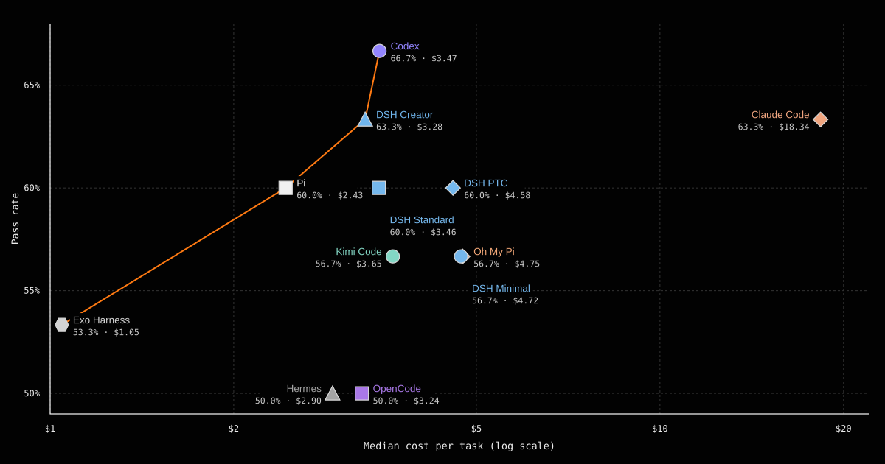
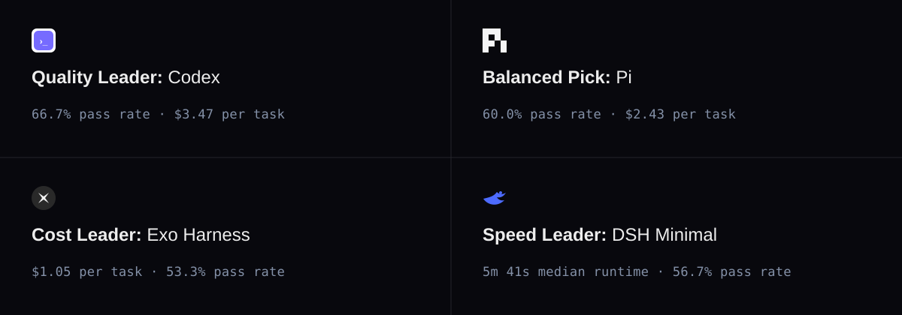

<h1 align="center">FrontierHarness Eval</h1>

<p align="center">
  <a href="https://frontierharness.org"></a>
  
  
  
  
  
  
</p>

<p align="center">
  <a href="https://frontierharness.org"><strong>Explore the live results →</strong></a>
  &nbsp;·&nbsp;
  <a href="https://runta.com/blog/introducing-frontierharness-eval/"><strong>Read the blog →</strong></a>
  &nbsp;·&nbsp;
  <a href="#evaluate-your-own-harness"><strong>Evaluate your own harness →</strong></a>
</p>

<div align="center"></div>

<div align="center">
  <a href="https://frontierharness.org">
    
  </a>
</div>

<div align="center"></div>

## Similar pass rate. 17.5x cost differences.

We ran the same **Kimi K3** model through nine coding-agent harnesses—12 configurations in total—on the same 30 software-engineering tasks. With the model, tasks, and runtime held constant, changing the harness changed pass rate, cost, cache behavior, and speed.

<div align="center">
  <a href="https://frontierharness.org">
    
  </a>
</div>

### Full results

| Harness (configuration) | Pass rate | Median cost per pass | Cache, median cell | Median time |
| --- | --- | --- | --- | --- |
| **Codex** | **66.7%** | $3.47 | 88.0% | 6m 43s |
| DSH Creator | 63.3% | $3.28 | 84.3% | 6m 44s |
| Claude Code | 63.3% | $18.34 | 67.8% | 9m 38s |
| Pi | 60.0% | $2.43 | 79.4% | 7m 33s |
| DSH PTC | 60.0% | $4.58 | 87.2% | 7m 44s |
| DSH Standard | 60.0% | $3.46 | 86.5% | 6m 17s |
| Oh My Pi | 56.7% | $4.75 | 82.2% | 6m 46s |
| Kimi Code | 56.7% | $3.65 | 88.0% | 7m 56s |
| DSH Minimal | 56.7% | $4.72 | 84.6% | 5m 41s |
| Exo Harness | 53.3% | **$1.05** | 70.3% | 6m 17s |
| OpenCode | 50.0% | $3.24 | 78.4% | 6m 27s |
| Hermes | 50.0% | $2.90 | 85.9% | 6m 58s |

The [interactive report](https://frontierharness.org) includes failed runs, total cost per task, cache behavior, speed, and task-level results. For the evaluation design and analysis, read the [launch article](https://runta.com/blog/introducing-frontierharness-eval/).

## What is in this repository

```text
.
├── benchmark.json              # Public benchmark definition
├── metadata/
│   ├── difficulty.json         # Difficulty assignments and source methodology
│   └── harness-versions.json   # Harness versions used for the run
├── results/
│   └── eval-data.json          # Normalized aggregate and task-level results
├── tasks/<task>/
│   ├── instruction.md          # Prompt shown to every harness
│   └── task.toml               # Public task metadata and environment definition
└── skills/frontierharness-eval/  # Agent-neutral skill, usable by hand
    ├── SKILL.md                # Evaluation workflow for a third-party harness
    ├── reference.md            # Command reference, runner templates, troubleshooting
    └── scripts/                # Provisioning, trial runner, scoring, chart, report
```

The repository intentionally contains **results, task definitions, and the evaluation workflow**. Internal infrastructure, credentials, runtime identifiers, private evidence, solutions, and deployment configuration are not included.

## Evaluate your own harness

The workflow that produced the table above ships with this repository, so a harness that is not in it can be scored on the same tasks, runtime, and cost accounting, then placed directly next to the twelve baseline configurations.

[`skills/frontierharness-eval/`](skills/frontierharness-eval/) is an agent-neutral skill: point any coding agent that reads `SKILL.md` at it and it will drive the whole run. Nothing in it is tied to a particular agent — the steps are plain Bash and Node, so you can equally run them by hand. Run everything from the repository root:

```bash
export RUNTA_TOKEN=rt_...          # Runta dashboard -> Settings -> Runta API Keys
export FIREWORKS_API_KEY=...       # or the key for whichever provider you pick, below
FH=skills/frontierharness-eval/scripts
```

**The model is not a variable, but the provider is.** Every published configuration runs **Kimi K3**, so that the harness is the only thing that differs, and your run has to match to be comparable. Which provider serves it is up to you — pass `--provider` to both scripts and the model route and key name follow from it:

| `--provider` | Model route | Key |
| --- | --- | --- |
| `fireworks` *(default, used by the published runs)* | `fireworks_ai/accounts/fireworks/models/kimi-k3` | `FIREWORKS_API_KEY` |
| `moonshot` | `moonshot/kimi-k3` | `MOONSHOT_API_KEY` |
| `openrouter` | `openrouter/moonshotai/kimi-k3` | `OPENROUTER_API_KEY` |
| `together` | `together_ai/moonshotai/Kimi-K3` | `TOGETHER_API_KEY` |
| `custom` | your `--model` | your `--secret-name` |

Same weights from a different provider means your **pass rate stays comparable**; only the cost column is at risk, since it depends on that provider's token prices. The report flags it for you if you used anything other than Fireworks. Overriding the *model* is what breaks comparability, and the scripts warn when you do.

**1. Freeze a golden checkpoint.** Creates a clean Runta runtime, clones your harness at a pinned commit, installs [Harbor](https://www.tbench.ai/) for Terminal-Bench tasks and [Pier](https://deepswe.datacurve.ai/run) for DeepSWE tasks, pre-pulls the task images, and captures the whole stack as one checkpoint. Your provider key is stored as a Runta secret stub, so it never enters the runtime or the checkpoint.

```bash
$FH/provision-golden-checkpoint.sh \
  --runtime fh-build --checkpoint fh-golden-myharness-v1 \
  --harness my-harness --provider fireworks \
  --repo https://github.com/acme/my-harness --commit 9f2c1ab \
  --cpus 4 --memory 8192 --prepull-tasks tasks \
  --install-script ./install-my-harness.sh
```

**2. Run the tasks.** Each task gets its own fresh restore of that checkpoint and the runtime is deleted afterwards, so every trial starts from an identical cold start. The agent trajectory, verifier logs, and `model.patch` are copied out per task as evidence.

```bash
jq -r '.harnesses[0].task_details[].id' results/eval-data.json > tasks.txt   # the published 30 tasks
$FH/run-trials.sh \
  --checkpoint fh-golden-myharness-v1 --harness my-harness \
  --provider fireworks --run-id 2026-09-02-myharness \
  --tasks tasks.txt --out runs
```

Pass the same `--provider` you provisioned with — the checkpoint carries that provider's key name as a stub.

**3. Score it, chart it, share it.**

```bash
node $FH/normalize-results.mjs --run runs/2026-09-02-myharness --label "My Harness"
node $FH/generate-chart.mjs    --run runs/2026-09-02-myharness
node $FH/build-report.mjs      --run runs/2026-09-02-myharness
```

Everything lands in `runs/<run-id>/report/`: a `chart.svg` with your harness highlighted against all twelve baselines, a `REPORT.md`, and a self-contained `index.html` you can open or attach anywhere. To publish a link:

```bash
gh gist create runs/2026-09-02-myharness/report/REPORT.md \
               runs/2026-09-02-myharness/report/chart.svg --public
```

### Keeping a result comparable

A score only belongs next to the published numbers if the run holds these invariants. The report states any that were relaxed.

- **Kimi K3**, the same model every published configuration used, otherwise harness effects and model effects are inseparable. Any provider serving it is fine for pass rate; for cost, check its token prices match the ones in [`reference.md`](skills/frontierharness-eval/reference.md).
- **One golden checkpoint, one fresh restore per task**, with identical vCPU, memory, and disk on every restore.
- **No formal task executed before the checkpoint is frozen.** Pre-pulling images is environment prep; running a task early is warm-cache bias. The provisioning script only ever warms on `terminal-bench-sample`.
- **Infrastructure failures marked `infra_invalid`**, not scored as task failures.

Cost is compared on `effective_cost_per_pass`, which is total cost across all tasks divided by passes and is reproducible from raw per-task cost. The `*_normalized` fields in `results/eval-data.json` reprice first-turn cache reads using data that is not public, so the scoring script leaves them empty rather than inventing values.

Metric definitions and the trial record contract are in [`SKILL.md`](skills/frontierharness-eval/SKILL.md). Runner templates, the alternative Harbor-with-Runta-provider topology, and troubleshooting are in [`reference.md`](skills/frontierharness-eval/reference.md).

MiniMax Code is available through Harbor's built-in `mcode` adapter. Its profile pins
Harbor, Node, `@minimax-ai/code`, and both task sources; runs all 30 published task IDs
through Harbor; and handles offline agent setup plus provider-specific connection
mapping:

```bash
$FH/run-minimax-code.sh --provider fireworks --print-command
```

See the [MiniMax Code profile](skills/frontierharness-eval/minimax-code.md) for the
golden-checkpoint, smoke-test, and full-run commands.

## Methodology

### Tested harness configurations

| Configuration | Version | Configuration | Version |
|---|---:|---|---:|
| Codex | `0.148.0` | DSH Creator | `0.1.0-rc.8` |
| Claude Code | `2.1.237` | DSH Minimal | `0.1.0-rc.8` |
| Pi | `0.84.2` | DSH PTC | `0.1.0-rc.8` |
| DSH Standard | `0.1.0-rc.8` | Oh My Pi | `17.4.0` |
| Kimi Code | `0.37.2` | Exo Harness | `0.1.0` |
| OpenCode | `1.18.19` | Hermes | `0.20.4` |

<div align="center"></div>

- FrontierHarness v1.0 focuses on software engineering contexts and terminal-based tasks. It may not generalize to other areas of knowledge work.
- Evaluated on Runta agent runtimes. For each task, all harnesses and the environment defined in `task.toml` are prepared once as a golden checkpoint. Every run is a fresh restore with identical vCPU, memory, disk size, disk contents, and memory state.
- Kimi K3 is served by [Fireworks](https://fireworks.ai/).

### Benchmark scope

- **30 tasks:** 21 Terminal-Bench tasks and 9 DeepSWE tasks
- **9 harnesses:** Claude Code, Codex, DeepSeek Harness, Exo Harness, Hermes, Kimi Code, Oh My Pi, OpenCode, and Pi
- **12 configurations:** one canonical result for every task and harness-configuration pair
- **360 evaluations:** complete task-by-harness coverage
- **Deterministic scoring:** verifier-based pass/fail outcomes
- **Comparable cost:** first-turn cache reads repriced consistently across harnesses

See [`benchmark.json`](benchmark.json) for the public benchmark definition and [`results/eval-data.json`](results/eval-data.json) for the complete normalized result set.

## Use the data

```bash
jq '.harnesses[] | {name, successful, effective_cost_per_pass}' results/eval-data.json
```

Every task directory contains the exact public instruction and task metadata used by the benchmark.

<div align="center"></div>

## Sponsor

Runta provided the isolated runtimes and Golden Checkpoint restores used across all 360 evaluations.

<p align="center">
  <a href="https://runta.com"></a>
</p>
