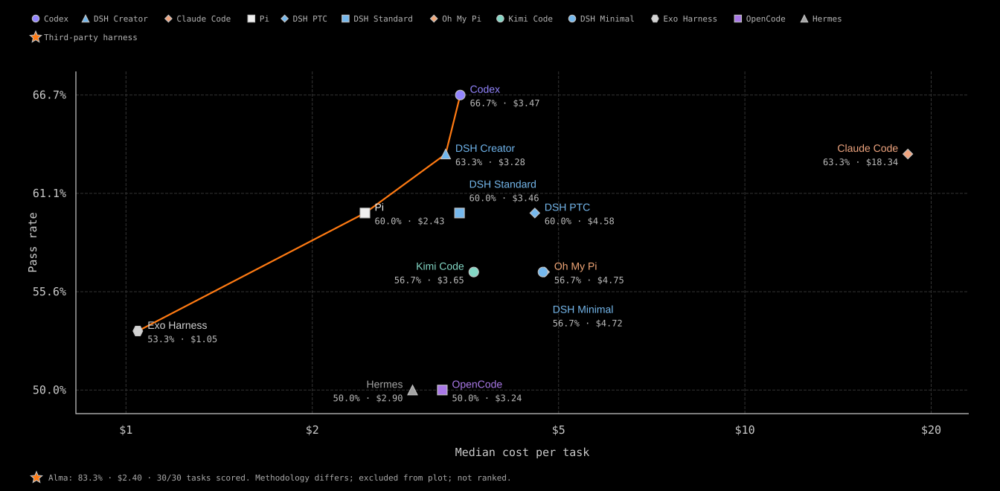

# Alma on FrontierHarness Eval — Kimi K3 via Fireworks

Candidate result for maintainer reproduction. Data only; nothing under
`results/eval-data.json`, `benchmark.json` or the skill scripts is changed.

## Result

| | Alma (this run) | Codex (best published) | Claude Code | Pi |
| --- | --- | --- | --- | --- |
| Pass rate | **83.3 %** (25/30) | 66.7 % (20/30) | 63.3 % | 60.0 % |
| Terminal-Bench (21) | 17 pass / 4 fail | 15 / 6 | | |
| DeepSWE (9) | 8 pass / 1 fail | 5 / 4 | | |
| `effective_cost_per_pass` | **$2.40** | $3.47 | $18.34 | $2.43 |
| Total cost, 30 tasks | $60.01 | | | |
| Median time per success | **4 m 32 s** | 6 m 43 s | 9 m 38 s | 7 m 33 s |
| Median cache hit rate | 89.7 % | 88.0 % | 67.8 % | 79.4 % |
| Mean turns (successes) | 39.8 | 62.4 | 49.3 | 18.7 |
| `infra_invalid` | 0 | | | |



Scored by the unmodified official verifiers and the unmodified official
`normalize-results.mjs` / `calculate-cost.py`: one attempt per task, no
best-of-N, no re-run of any trial whose agent had started, all five failures
counted. `candidate.json` is the normalizer's output as written; `report/` is
the output of `build-report.mjs` and `generate-chart.mjs`. Costs are the
official price table (`kimi-k3-2026-08-20`) applied to the per-call usage the
provider returned — no repricing.

Three tasks that none of the twelve published configurations passed are solved
here: `datacurve/scc-bounded-memory-spilling`, `terminal-bench/kv-store-grpc`
and `terminal-bench/largest-eigenval`.

This is a comparison of recorded pass rates on identical task definitions and
the same pipeline, submitted as a candidate for maintainer reproduction, not a
claim of an official leaderboard placement. `candidate.json` carries the
normalizer's own `comparable: false` note: the published baselines did not
record the egress policy they ran under.

### Where the passes come from

Against Codex (the highest published configuration), Alma passes seven tasks
Codex does not (`fastapi-deprecation-response-headers`,
`katex-multicolumn-array-spans`, `scc-bounded-memory-spilling`, `dna-insert`,
`extract-elf`, `kv-store-grpc`, `largest-eigenval`) and fails two Codex passes
(`code-from-image`, `sanitize-git-repo`). Every trajectory is in `trials/`;
the audit below is over all 1,324 tool calls of the run.

- Tool surface: Bash 854, Edit 214, Read 205, Write 39, BashOutput 9, Grep 3.
  Every call executed inside the task container; no web, browser or
  sub-agent tools.
- Hidden tests: the verifier resets and re-applies `test.patch` after the
  agent finishes, so agent edits under `/app/tests` cannot reach the score;
  `/logs/verifier` is empty during the agent phase. One trajectory
  (`extract-elf`) searched the filesystem for reference or test files, found
  none, and then wrote its own extractor.
- Egress: the three DeepSWE passes above were solved with no network at all
  (those containers do not resolve external hosts; the trajectories show the
  attempts failing). `largest-eigenval` installed scipy but the final
  `eigen.py` imports only numpy. **Two passes depend on the allowlist:**
  `kv-store-grpc` (the task's first step is `pip install grpcio==1.73.0`, so
  it is unsolvable without PyPI) and `dna-insert` (`apt-get install primer3`
  to obtain `oligotm`, which the task names as the melting-temperature
  ground truth). The same allowlist is what the official verifiers use to
  install pytest, so it is not a deviation; whether the published baselines
  ran under it is not recorded. Discounting both, the run is 23/30 (76.7%).
- Sampling: one attempt per task, no best-of-N; timeouts are recorded as
  failures verbatim.

## Setup

| Field | Value |
| --- | --- |
| Harness | Alma `a26dd7b4858c33db4d48d0eed271f163d919b444` (v0.4.36), https://github.com/yetone/alma |
| Model | `fireworks_ai/accounts/fireworks/models/kimi-k3`, served by Fireworks (same provider as the baselines) |
| Pipeline | this repository at `e837a70` plus `eval-deviations.patch` (two files, see below) |
| Golden checkpoint | `alma-golden-v10`, one fresh restore per task, 4 vCPU / 8192 MiB / 100 GiB |
| Harbor / Pier | `0.22.0` / `0.3.1` |
| DeepSWE corpus | `435ee89ec2f2e2289f33b0da4f992f0b7b7266b9` |
| Trial egress | the pipeline's own 15-host runtime allowlist, verbatim (`run-config.json`) |
| Task timeouts | each task's own `[agent] timeout_sec` from `tasks/<task>/task.toml`, enforced by Harbor/Pier |
| Run id | `alma-full-20260911-2300`, 2026-09-11T15:02Z → 2026-09-12T04:55Z, 6 h 28 m of agent time |
| Provider key | Runta secret; the runtime only ever saw `runta-secret-stub` |

## How Alma was run

The published harnesses are CLIs that Harbor/Pier install inside the task
container. Alma is a server application (the Express + WebSocket process the
desktop app hosts in its main process) with a remote-workspace stack for
machines reached over ssh, so it ran the other way round:

- The headless server build (`bin/server.mjs`) lived on the Runta runtime
  host next to Harbor/Pier, baked into the golden checkpoint from a git
  bundle of commit `a26dd7b4` (Node 22 + pnpm; started once to write the
  provider and settings, then stopped, before any task ran).
- Each task container was registered as an Alma **remote host**. Alma's ssh
  transport was pointed at a shim that turns `ssh <container> <cmd>` into
  `docker exec -i <container> sh -c <cmd>`, so every command, read and edit
  went through Alma's ordinary remote-host code path and executed inside the
  container. DeepSWE tasks keep `network_mode: none`; `docker exec` is
  unaffected.
- A driver script (`alma-drive.mjs`, ~600 lines) speaks only Alma's public
  REST/WebSocket API: `POST /api/remote-hosts` (container as ssh target),
  `POST /api/workspaces` on `/app`, `POST /api/threads` bound to that
  workspace, the task instruction sent over `/ws/threads` with an explicit
  tool list (Bash, BashOutput, KillShell, Read, Write, Edit, Glob, Grep), a
  poll on the thread until the turn ends or the task's own `timeout_sec`
  arrives (one steer message shortly before the deadline, no retries), then
  the thread traces and the proxy's per-response usage log written to
  `/logs/agent` for `usage_details.py`. The official verifier then runs in
  the same container as for any other harness.
- Model traffic: Alma → local logging proxy (`fw-proxy.mjs`, 127.0.0.1) →
  `api.fireworks.ai`; the key is a Runta secret the runtime only sees as a
  stub.

Why not the `alma` CLI: `alma run` is a thin client of the same server. It
creates a thread, sends one message over the websocket, streams the reply
and deletes the thread; it assumes an already-running server, runs the turn
in the server's own working directory rather than a remote workspace, cannot
restrict the tool set or steer near a deadline, and discards the transcript
on exit. The driver is `alma run` plus those five things; the generation
code is the same either way. The adapter (driver, shim, Harbor/Pier agent
files, install script) is not in this PR; it is available to maintainers on
request.

## Held and relaxed invariants

Held: Kimi K3; one golden checkpoint, one fresh restore per task, identical
resources; no task executed before the checkpoint was frozen; official task
definitions, verifiers, and native time limits unmodified; infrastructure
failures never scored as task failures (there were none that reached scoring).

Relaxed or adapted, stated in full:

1. **Topology.** Alma is a server application, not a CLI. It runs on the
   runtime host (`--harness-topology runtime-service`, as the merged pipeline
   allows) and drives the task container through `docker exec`; the published
   harnesses were installed inside the container. Every read, edit and command
   Alma performs on the task happens inside the container. DeepSWE containers
   stay on `network_mode: none`.
2. **Private harness source.** The Alma repository is private at the time of
   submission. `provision-golden-checkpoint.sh` gains a `--repo-bundle` option
   so the harness is uploaded as a `git bundle` and cloned from the local file
   instead of over the network; `--repo`/`--commit` are still recorded as the
   harness identity. This is the first hunk of `eval-deviations.patch`.
   A reproduction bundle (source at `a26dd7b4`, install script, Harbor and
   Pier adapters, driver) is available to maintainers on request.
3. **Per-call usage extraction.** `usage_details.py` has a fixed registry of
   harness → usage log; an unregistered harness silently gets `turns: null`
   and `cost_first_cold_usd: null`. The patch adds an `alma` entry reading the
   `fw-usage.jsonl` that Alma's provider proxy writes into each trial's
   `agent/` directory, with a parser of the same shape as the registered `exo`
   entry. The repricing this enables charges the first call's cached prefix at
   the fresh rate, so it can only raise Alma's reported cost. (The same hunk
   also adds a `pi` alias of the existing `pi-responses` entry; that alias is
   inert for this run.) This is the second hunk of `eval-deviations.patch`.
4. **DeepSWE ref.** `--deep-swe-ref 435ee89`: the script asks for `v1.1` of
   `datacurve-ai/deep-swe`, which carries only a `v1.0.0` tag; `435ee89` is
   the commit whose task definitions match the ones shipped in `tasks/`.
   `datacurve-pier==0.3.1` takes `--jobs-dir`, not `--output-dir`.
5. **No pre-pulled task images in the checkpoint.** A checkpoint with the
   ~22 GiB of task images never left `creating` on Runta; every trial pulls
   its own image during environment setup, before the agent timeout starts.
   The checkpoint was also created with `--keep-runtime` (a checkpoint whose
   source runtime is deleted before it is `ready` never becomes ready) and the
   build runtime removed by hand afterwards.
6. **Runta's `runc` wrapper** is re-pointed at `/usr/bin/runc` at trial time
   as well as at provisioning, because that symlink is host state a restore
   does not carry (the merged pipeline's `restore-system-runc.sh` covers
   provisioning only).
7. **Recovery.** The Runta API was unreachable from the operator machine for
   about six hours mid-run. The official `run-trials.sh` was re-invoked,
   unmodified, relying on its own resume semantics: scored trials kept,
   retained runtimes reconnected, failed restores restored afresh. 26 attempts
   failed at `checkpoint restore` and one at `task image pull failed` before
   any agent process started; two trials (`fastapi-deprecation-response-headers`,
   `extract-elf`) had their evidence transfer interrupted after the agent had
   finished and were reclaimed from the retained runtime. No task's agent ran
   more than once. Midway the controller was moved to a second machine with
   the same CLI and the same checkout; the trial in flight was reconnected,
   not restarted.

## The five failures

| Task | What happened | Final message claims completion? |
| --- | --- | --- |
| `datacurve/meriyah-explicit-resource-declarations` | F2P 46/49, P2P 51469/51469 — near miss on three `using`-declaration cases | yes ("94,538 tests passing") |
| `terminal-bench/sanitize-git-repo` | secret removed correctly (2/3 tests), but the history rewrite dropped a commit the verifier resolves by SHA | yes ("fully scrubbed") |
| `terminal-bench/gcode-to-text` | wrote a confident wrong transcription of its own rendering | yes |
| `terminal-bench/chess-best-move` | hit the task's 900 s agent timeout mid-work, never wrote `/app/move.txt` | no (cut off) |
| `terminal-bench/code-from-image` | hit the task's 1200 s agent timeout mid-work, wrong transcription in place | no (cut off) |

Nothing the agent says reaches the scorer, so the completion claims do not
move the score; they are recorded because a reader of the transcripts would
be misled by them.

## Lineage

The previous recorded run of Alma on this suite (2026-09-07, Alma `cf28fcfa`)
scored 22/30 at $2.40 per pass. Between the two: six tasks recovered
(`scc-bounded-memory-spilling`, `expr-try-catch-errors`,
`katex-multicolumn-array-spans`, `dna-insert`, `largest-eigenval`,
`polyglot-c-py`), three regressed (`chess-best-move`, `code-from-image`,
`sanitize-git-repo`). The harness changes in between are five targeted fixes
that came out of reading the 2026-09-07 trajectories (bounded command output
reaching the model, an explicit Bash timeout honoured, a retried generation
resuming from the persisted partial turn, PNGs under the size caps no longer
re-encoded, the task's named output file written before the first expensive
step) plus unrelated product commits merged in the same window. It is not a
clean A/B. Two further full runs were made on 2026-09-10 (22/30 and 23/30);
their evidence was lost when the operator machine rebooted and cleared its
temporary directory, so they are mentioned for completeness and nothing here
rests on them.

## What is in this directory

- `candidate.json` — untouched output of `normalize-results.mjs`
- `run-config.json` — the run's `run.json`: command template, timeout,
  egress allowlist, per-task metadata
- `trials/<task>/trial.json` — the official per-trial records (30). The only
  edit is `raw_result_path`, rewritten from an absolute operator path to a
  path relative to the run directory.
- `report/` — `build-report.mjs` and `generate-chart.mjs` output
- `eval-deviations.patch` — the complete `git diff` of the checkout that ran
  this run against `e837a70`; `git apply` it and the pipeline is byte-identical
  to what was used

Full raw evidence — 30 per-task bundles with complete agent transcripts, tool
calls, per-call usage, verifier stdout, `reward.json` and the runner's leaf
`result.json` (~200 MB) — is preserved outside this PR and available to
maintainers on request, as is the reproduction bundle for the private
harness.

Independent checks that need nothing but this directory:

```bash
cd results/candidates/frontierharness-alma-kimi
jq '[.task_details[] | select(.success)] | length' candidate.json                # 25
jq -s 'map(select(.success)) | length' trials/*/trial.json                     # 25
jq -s 'map(.cost_usd) | add' trials/*/trial.json                               # 60.0067
jq -s 'map(select(.status=="infra_invalid")) | length' trials/*/trial.json     # 0
```
